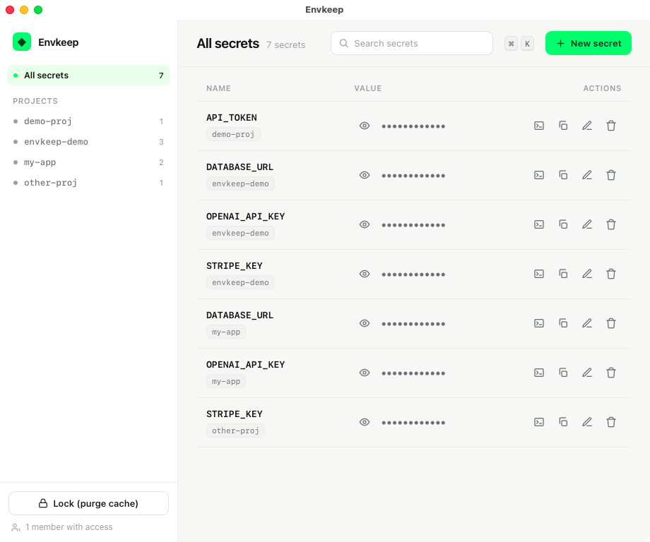

<div align="center">


# Envkeep

**A secure, age-encrypted home for your team's ENV secrets — a native macOS app for humans, a CLI for your AI coding agents.**

[](https://github.com/jackofshadowz/envkeep/actions/workflows/ci.yml)
[](LICENSE)


<br/>



</div>

---

So you can just tell your coding agent:

> *"the OpenAI key is in **envkeep** — grab `my-app/OPENAI_API_KEY`."*

…and it runs `envkeep get my-app/OPENAI_API_KEY`, pulling exactly one value on demand. No secret pasted into chat, no `.env` lying around, nothing in plaintext at rest.

## ✨ Features

| | |
|---|---|
| 🔐 **Encrypted at rest** | An [age](https://github.com/FiloSottile/age)-encrypted `vault.age` — only ciphertext ever hits disk or git. |
| 🖥️ **Native macOS app** | A real Swift / WKWebView window (not a browser tab) with its own Dock icon and menus. |
| ⌨️ **CLI for agents** | `envkeep get NAME` prints one value; `envkeep env project` loads a whole project. |
| 🗂️ **Projects & folders** | Organise secrets as `project/KEY`; the GUI groups them, the CLI dumps them. |
| 🧭 **Command palette** | ⌘K to jump to any project, secret, or action. Plus `n`, `/`, `l` shortcuts. |
| ⛔ **Decrypt-on-demand** | No plaintext cache by default; optional Keychain cache + one-click **Lock**. |
| 📥 **Import** | `envkeep import ./my-app` scans `.env` files and pulls them in (dry-run first). |
| 📜 **Audit log** | Every read/write is logged — names only, never values. |
| 👥 **Team-ready** | Share the encrypted vault via a private git repo; add members by public key. |
| 🪶 **Zero dependencies** | Pure Python 3 stdlib + `age`. No pip, no server, no database. |

## 🚀 Quickstart

**Homebrew (recommended):**

```bash
brew install jackofshadowz/tap/envkeep
envkeep init          # creates your key, vault, and recipients entry
```

**curl one-liner:**

```bash
curl -fsSL https://raw.githubusercontent.com/jackofshadowz/envkeep/main/web-install.sh | bash
envkeep init
```

**pipx / pip** (Python tool):

```bash
pipx install envkeep        # or: pip install envkeep
envkeep init
```

**From source** (also builds the native app):

```bash
git clone https://github.com/jackofshadowz/envkeep.git
cd envkeep
./install.sh          # symlinks `envkeep` onto your PATH, installs age via brew
envkeep init
./build-app.sh && open Envkeep.app    # optional native macOS app
```

> Prefer the app? Download `Envkeep.app` from the
> [latest release](https://github.com/jackofshadowz/envkeep/releases/latest).

Add a secret, then read it in a coding session:

```bash
envkeep set my-app/OPENAI_API_KEY      # hidden prompt; or pass inline
envkeep get my-app/OPENAI_API_KEY      # prints just the value
eval "$(envkeep env my-app)"           # load the whole project into your shell
```

## 🧠 How it works

```
   GUI  (you)                          CLI  (Claude / coding sessions)
   Envkeep.app                         envkeep get my-app/OPENAI_API_KEY
        │                                        │
        ▼                                        ▼
  ┌────────────────┐                   ┌───────────────────────┐
  │   vault.age    │   age-encrypted   │  decrypts ONE value   │
  │  (source of    │ ◀───────────────▶ │  on demand — nothing  │
  │  truth, in a   │   to each member  │  persisted in plain   │
  │  private repo) │                   └───────────────────────┘
  └────────────────┘
```

* **Source of truth** — `vault.age`, encrypted to every teammate's age public key (`recipients.txt`). The git host only ever sees ciphertext.
* **Your private key** lives at `~/.config/envkeep/identity.txt` (`chmod 600`), never committed.
* **Reads decrypt on demand.** Enable a Keychain cache for speed (`envkeep config cache keychain`); `envkeep lock` purges it.

## 🛠️ CLI reference

```bash
envkeep set  my-app/STRIPE_KEY [value]   # add / update (hidden prompt if omitted)
envkeep get  my-app/STRIPE_KEY           # print one value
envkeep list [project]                   # names only
envkeep folders                          # list projects
envkeep env  my-app [--dotenv]           # export lines (or .env format)
envkeep import ./path [--apply]          # scan .env files (dry-run by default)
envkeep rm   my-app/STRIPE_KEY
envkeep pubkey | members | add-member alice age1…
envkeep remove-member alice              # revoke a member + re-encrypt
envkeep rotate-identity                  # new vault key + re-encrypt (key rotation)
envkeep gui                              # the same UI in your browser

# security
envkeep protect-key      # encrypt the vault key with a passphrase
envkeep unlock           # unlock the passphrase-protected key for this session
envkeep lock             # re-lock the key / 2FA + purge cached plaintext
envkeep unprotect-key    # remove passphrase protection
envkeep config           # view settings
envkeep config cache keychain|none       # plaintext cache vs decrypt-on-demand
envkeep config autolock <minutes>        # auto-relock window (cache mode)
envkeep config touchid on|off            # Touch ID gate (app)
envkeep config log on|off                # access log
envkeep log [--tail N]                   # show the access log
```

GUI shortcuts: **⌘K** palette · **n** new · **/** search · **l** lock · **Esc** close · **⌘↵** save.

## 👥 Sharing with a team

1. A teammate runs `envkeep init` and sends you `envkeep pubkey` → `age1…`.
2. You run `envkeep add-member alice age1…` (re-encrypts the vault for everyone).
3. They point their vault dir at the shared private repo. `envkeep members` lists access.

**Revoking & rotating:** `envkeep remove-member alice` (or the × in Settings → Team)
re-encrypts the vault for everyone who remains. `envkeep rotate-identity` issues you a
brand-new key and re-encrypts — use it if your key may be exposed. After either, rotate
the secret *values* a departed member knew.

## 🔒 Security

Envkeep is layered — turn on as much as you need. Configure it all in **Settings**
(GUI) or via `envkeep config` / the commands above.

### Security levels
One-click presets in Settings:

| Level | Storage | Gate |
|---|---|---|
| **Relaxed** | Keychain cache (fast) | none |
| **Balanced** | decrypt-on-demand | Touch ID |
| **Strict** | decrypt-on-demand | Touch ID + short auto-relock (add 2FA for max) |

### Storage modes
- **Decrypt-on-demand** (default) — no plaintext is persisted anywhere; every read decrypts the vault.
- **Keychain cache** (`envkeep config cache keychain`) — decrypted values cached in the macOS Keychain for speed, purged by **auto-lock** (`config autolock <min>`) or `envkeep lock`.

### Gates (protect reveal/copy in the app)
- **Touch ID** (`config touchid on`) — biometric/password before a value is shown or copied.
- **Two-factor / TOTP** — a 6-digit code from **Authy, Google Authenticator, or 1Password**. Enroll in Settings → Two-factor; reveals are then gated until you enter a code.
- **Auto-relock** — Touch ID and 2FA sessions expire after the configured window, then re-prompt.
- **Lock** (`envkeep lock`, or the app button) — immediately re-locks every enabled gate + purges the cache. With **no** gate enabled it only purges the cache (the app warns you).

### At-rest key protection
- **Passphrase-encrypted key** (`envkeep protect-key`, or Settings → Vault key encryption) — encrypts your age identity itself (openssl AES-256 + PBKDF2). The plaintext key file is removed, so a **stolen key file is useless**. Unlock once per session (`envkeep unlock` or the app's unlock screen). ⚠ No recovery if you forget the passphrase.

### Other
- **Clipboard auto-clear** — copied secret *values* are wiped from the pasteboard ~45s later (native app).
- **Audit log** — every read/write is appended to `~/.config/envkeep/access.log` (names + actions, **never values**).

### Honest caveats
- Only **ciphertext** is ever stored or pushed — a stolen repo / laptop-at-rest exposes nothing.
- **The CLI runs as you**, so a coding agent you trust to run commands can read any secret it's pointed at. Prefer handing it the *name* (or `envkeep env`) and injecting via the environment rather than printing values into a transcript.
- The Touch ID / 2FA gates protect the **app reveal path**; they don't gate the CLI (agents need it). For true at-rest protection of the key, use **passphrase encryption**.
- Removing a member re-encrypts going forward — **rotate** anything they knew.
- Back up your key/passphrase (e.g. a password manager); lose them and you lose access.
- Lightweight by design — **not** a replacement for HashiCorp Vault / an HSM.

## 📦 Requirements

macOS · `age` + `age-keygen` (`brew install age`) · Python 3 (system Python is fine) · `openssl` (ships with macOS; used for passphrase key encryption) · Xcode CLT (`swiftc`) for the native app.

## 📄 License

[MIT](LICENSE) © 2026 Jack Baum
